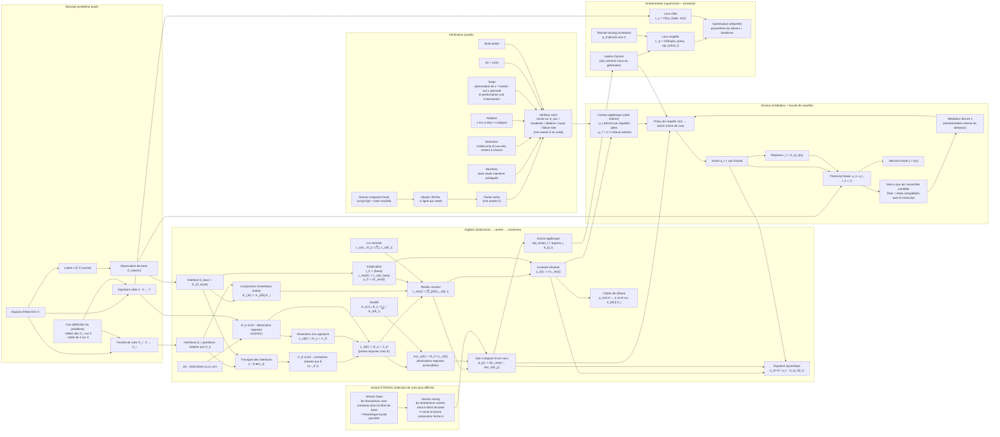

# Algèbre → Solveur → Tests (vue d’ensemble)

```mermaid
flowchart LR
  %% =========================
  %% 0) Problem / Episode
  %% =========================
  subgraph P["Épisode (problème posé)"]
    X["Espace d’états finis X"]
    sig["Signature cible σ : X → Y"]
    views["Famille de vues O_i : X → V_i"]
    xlat["Latent x ∈ X (caché)"]
    base["Observation de base O_base(x)"]
    cue["Cue (définition du problème)\n- tables des O_i sur X\n- table de σ sur X"]
    X --> sig
    X --> views
    X --> xlat --> base
    cue --> views
    cue --> sig
  end

  %% =========================
  %% 1) Algebra (distinctions → losses → residual)
  %% =========================
  subgraph A["Algèbre (distinctions → pertes → incidence)"]
    DX["ΔX : distinctions {u,v}, u≠v"]
    Rsig["R_σ ⊆ ΔX : distinctions requises\nσ(u)≠σ(v)"]
    Ei["Interfaces E_i (partitions induites par O_i)"]
    Ebase["Interface E_base = E_{O_base}"]
    Cmap["Transport des interfaces\nC : E ↦ C_E"]
    Ci["C_E ⊆ ΔX : confusions induites par E\n(u~_E v)"]
    Lmap["Restriction à la signature\nL_σ(E) := R_σ ∩ C_E"]
    Li["L_σ(E) := R_σ ∩ C_E\n(pertes requises sous E)"]
    Acc["Acc_σ(E) := R_σ \\ L_σ(E)\n(distinctions requises accessibles)"]

    Meet["Conjonction d’interfaces (meet)\nE_{∧I} := ∧_{i∈I} E_i"]
    Lres["Résidu courant\nL_res(I) := ⋂_{i∈I} L_σ(E_i)"]
    rho["Invariant résiduel\nρ_σ(I) := # L_res(I)"]
    delta["Gain marginal d’une vue j\nΔ_j(I) := #(L_res(I) ∩ Acc_σ(E_j))"]
    closeCrit["Critère de clôture\nρ_σ(I)=0 ⇔ σ se lit sur ∧_{i∈I} O_i"]
    dynEq["Équation dynamique\nρ_{t+1} = ρ_t - Δ_{a_t}(I_t)"]
    oracle["Oracle algébrique\nopt_action_t = argmax_j Δ_j(I_t)"]
    init["Initialisation\nI_0 := {base}\nL_res(0) := L_σ(E_base)\nρ_0 := #L_res(0)"]

    DX --> Rsig
    Ei --> Cmap --> Ci
    Ebase --> Cmap
    Ci --> Li
    Rsig --> Lmap --> Li
    Rsig --> Li
    Li --> Acc

    Li --> Lres
    Meet --> Lres
    Ebase --> Meet
    Lres --> rho
    Lres --> delta
    Acc --> delta
    rho --> closeCrit
    delta --> oracle
    rho --> dynEq
    delta --> dynEq
    Ebase --> init
    init --> Lres
    init --> rho

    law1["Loi centrale\nL_σ(∧_i E_i) = ⋂_i L_σ(E_i)"]
    law2["Dualité\nA_σ(∧_i E_i) = ⋃_i A_σ(E_i)"]
    law1 --> Lres
    law2 --> Acc
  end

  %% =========================
  %% 2) Solver architecture (mediator + query loop)
  %% =========================
  subgraph S["Solveur (médiateur + boucle de requête)"]
    z["Médiateur discret z\n(représentation interne de sélection)"]
    pi["Policy de requête π(z) → action (choix de vue)"]
    act["Action a_t = vue choisie"]
    resp["Réponse r_t = O_{a_t}(x)"]
    trans["Transcript (base, a_1..a_t, r_1..r_t)"]
    update["Mise à jour de l’ensemble candidat\nFiber = états compatibles avec le transcript"]
    yhat["Décision finale ŷ ≈ σ(x)"]
    contract["Contrat algébrique (cible interne)\n- ρ_t décroît par requêtes utiles\n- ρ_T = 0 ⇒ clôture atteinte"]

    base --> trans
    act --> trans
    resp --> trans
    trans --> update --> z
    z --> pi --> act
    act --> resp
    trans --> yhat

    delta --> pi
    rho --> contract
    contract --> pi
    act --> dynEq
  end

  %% =========================
  %% 3) Training loop
  %% =========================
  subgraph T["Entraînement (supervision + schedule)"]
    opt["Labels d’action\n(opt_actions) issus du générateur"]
    lossq["Loss requête\nL_q = CE(logits_query, opt_action_t)"]
    lossy["Loss cible\nL_y = CE(y_logits, σ(x))"]
    tf["Teacher forcing (schedule)\np_tf décroît vers 0"]
    train["Optimisation (AdamW)\nparamètres du solveur + baselines"]
    opt --> lossq --> train
    sig --> lossy --> train
    tf --> lossq
  end

  %% =========================
  %% 4) Verification / Audits
  %% =========================
  subgraph V["Vérification (audits)"]
    snapshot["Runner snapshot+hash\n(script figé + hash sha256)"]
    master["Master JSONL\n(1 ligne par seed)"]
    partial["Partial verify\n(min-seeds=1)"]
    barriers["Barrières\nbase seule maintient ambiguïté"]
    baselines["Baselines\nvisible-only et cue-only restent à chance"]
    ablate["Ablation\nz mis à zéro ⇒ collapse"]
    swap["Swap\npermutation de z ⇒ action suit z permuté\net performance suit l’intervention"]
    iidood["IID + OOD"]
    multiseed["Multi-seeds"]
    verify["Vérifieur strict\nseuils sur A_acc / baselines / ablation / swap / follow-rate\n(min-seeds=5 en solid)"]

    snapshot --> master --> partial --> verify
    barriers --> verify
    baselines --> verify
    ablate --> verify
    swap --> verify
    iidood --> verify
    multiseed --> verify
  end

  %% =========================
  %% 5) Strong variant (view selection difficulty)
  %% =========================
  subgraph G["Variant STRONG (sélection de vues plus difficile)"]
    easy["Version base\nles distracteurs sont constants dans la fibre de base\n⇒ heuristique locale possible"]
    strong["Version strong\nles distracteurs varient dans la fibre de base\n⇒ seule la bonne conjonction ferme σ"]
    easy --> strong
  end

  %% =========================
  %% Cross-links
  %% =========================
  views --> Ei
  base --> Ebase
  Ei --> Meet
  sig --> Rsig

  oracle --> opt
  opt --> pi
  verify --> contract
  strong --> delta
```
