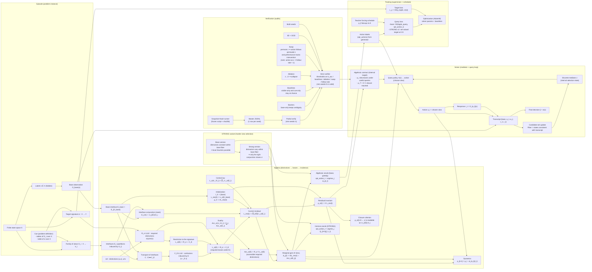

# Algebra → Solver → Tests (overview)

```mermaid
flowchart LR
  %% =========================
  %% 0) Problem / Episode
  %% =========================
  subgraph P["Episode (problem instance)"]
    X["Finite state space X"]
    sig["Target signature σ : X → Y"]
    views["Family of views O_i : X → V_i"]
    xlat["Latent x ∈ X (hidden)"]
    base["Base observation O_base(x)"]
    cue["Cue (problem definition)\n- tables of O_i over X\n- table of σ over X"]
    X --> sig
    X --> views
    X --> xlat --> base
    cue --> views
    cue --> sig
  end

  %% =========================
  %% 1) Algebra (distinctions → losses → incidence)
  %% =========================
  subgraph A["Algebra (distinctions → losses → incidence)"]
    DX["ΔX : distinctions {u,v}, u≠v"]
    Rsig["R_σ ⊆ ΔX : required distinctions\nσ(u)≠σ(v)"]
    Ei["Interfaces E_i (partitions induced by O_i)"]
    Ebase["Base interface E_base = E_{O_base}"]
    Cmap["Transport of interfaces\nC : E ↦ C_E"]
    Ci["C_E ⊆ ΔX : confusions induced by E\n(u~_E v)"]
    Lmap["Restriction to the signature\nL_σ(E) := R_σ ∩ C_E"]
    Li["L_σ(E) := R_σ ∩ C_E\n(required losses under E)"]
    Acc["Acc_σ(E) := R_σ \\ L_σ(E)\n(accessible required distinctions)"]

    Meet["Interface conjunction (meet)\nE_{∧I} := ∧_{i∈I} E_i"]
    Lres["Current residual\nL_res(I) := ⋂_{i∈I} L_σ(E_i)"]
    rho["Residual invariant\nρ_σ(I) := # L_res(I)"]
    delta["Marginal gain of view j\nΔ_j(I) := #(L_res(I) ∩ Acc_σ(E_j))"]
    closeCrit["Closure criterion\nρ_σ(I)=0 ⇔ σ is readable on ∧_{i∈I} O_i"]
    dynEq["Dynamics\nρ_{t+1} = ρ_t - Δ_{a_t}(I_t)"]
    oracle["Algebraic oracle (base, greedy)\nopt_action_t = argmax_j Δ_j(I_t)"]
    oracleH["Horizon oracle (STRONG)\nopt_action_t = argmin_j Q_{H-t}(j | τ_t)"]
    init["Initialization\nI_0 := {base}\nL_res(0) := L_σ(E_base)\nρ_0 := #L_res(0)"]

    DX --> Rsig
    Ei --> Cmap --> Ci
    Ebase --> Cmap
    Ci --> Li
    Rsig --> Lmap --> Li
    Rsig --> Li
    Li --> Acc

    Li --> Lres
    Meet --> Lres
    Ebase --> Meet
    Lres --> rho
    Lres --> delta
    Acc --> delta
    rho --> closeCrit
    delta --> oracle
    delta --> oracleH
    rho --> dynEq
    delta --> dynEq
    Ebase --> init
    init --> Lres
    init --> rho

    law1["Central law\nL_σ(∧_i E_i) = ⋂_i L_σ(E_i)"]
    law2["Duality\nAcc_σ(∧_i E_i) = ⋃_i Acc_σ(E_i)"]
    law1 --> Lres
    law2 --> Acc
  end

  %% =========================
  %% 2) Solver architecture (mediator + query loop)
  %% =========================
  subgraph S["Solver (mediator + query loop)"]
    z["Discrete mediator z\n(internal selection state)"]
    pi["Query policy π(z) → action (choose view)"]
    act["Action a_t = chosen view"]
    resp["Response r_t = O_{a_t}(x)"]
    trans["Transcript (base, a_1..a_t, r_1..r_t)"]
    update["Candidate-set update\nFiber = states consistent with transcript"]
    yhat["Final decision ŷ ≈ σ(x)"]
    contract["Algebraic contract (internal target)\n- ρ_t decreases under useful queries\n- ρ_T = 0 ⇒ closure reached"]

    base --> trans
    act --> trans
    resp --> trans
    trans --> update --> z
    z --> pi --> act
    act --> resp
    trans --> yhat

    delta --> pi
    rho --> contract
    contract --> pi
    act --> dynEq
  end

  %% =========================
  %% 3) Training loop
  %% =========================
  subgraph T["Training (supervision + schedule)"]
    opt["Action labels\n(opt_actions) from generator"]
    lossq["Query loss\n- base: CE(logits_query, opt_action_t)\n- STRONG v2: set-valued target at t=0"]
    lossy["Target loss\nL_y = CE(y_logits, σ(x))"]
    tf["Teacher forcing schedule\np_tf decays to 0"]
    train["Optimization (AdamW)\nsolver params + baselines"]
    opt --> lossq --> train
    sig --> lossy --> train
    tf --> lossq
  end

  %% =========================
  %% 4) Verification / Audits
  %% =========================
  subgraph V["Verification (audits)"]
    snapshot["Snapshot+hash runner\n(frozen script + sha256)"]
    master["Master JSONL\n(1 row per seed)"]
    partial["Partial verify\n(min-seeds=1)"]
    barriers["Barriers\nbase-only keeps ambiguity"]
    baselines["Baselines\nvisible-only and cue-only stay at chance"]
    ablate["Ablation\nz→0 ⇒ collapse"]
    swap["Swap\npermute z ⇒ action follows permuted z\nand performance tracks intervention\n(note: action-as-z ⇒ follow-rate ≈ 1)"]
    iidood["IID + OOD"]
    multiseed["Multi-seeds"]
    verify["Strict verifier\nthresholds on A_acc / baselines / ablation / swap / follow-rate\n(min-seeds=5 in solid)"]

    snapshot --> master --> partial --> verify
    barriers --> verify
    baselines --> verify
    ablate --> verify
    swap --> verify
    iidood --> verify
    multiseed --> verify
  end

  %% =========================
  %% 5) Strong variant (harder view selection)
  %% =========================
  subgraph G["STRONG variant (harder view selection)"]
    easy["Base version\n distractors constant within base fiber\n ⇒ local heuristic possible"]
    strong["Strong version\n distractors vary within base fiber\n ⇒ only the right conjunction closes σ"]
    easy --> strong
  end

  %% =========================
  %% Cross-links
  %% =========================
  views --> Ei
  base --> Ebase
  Ei --> Meet
  sig --> Rsig

  oracle --> opt
  opt --> pi
  verify --> contract
  easy --> oracle
  strong --> oracleH
  strong --> delta
```
