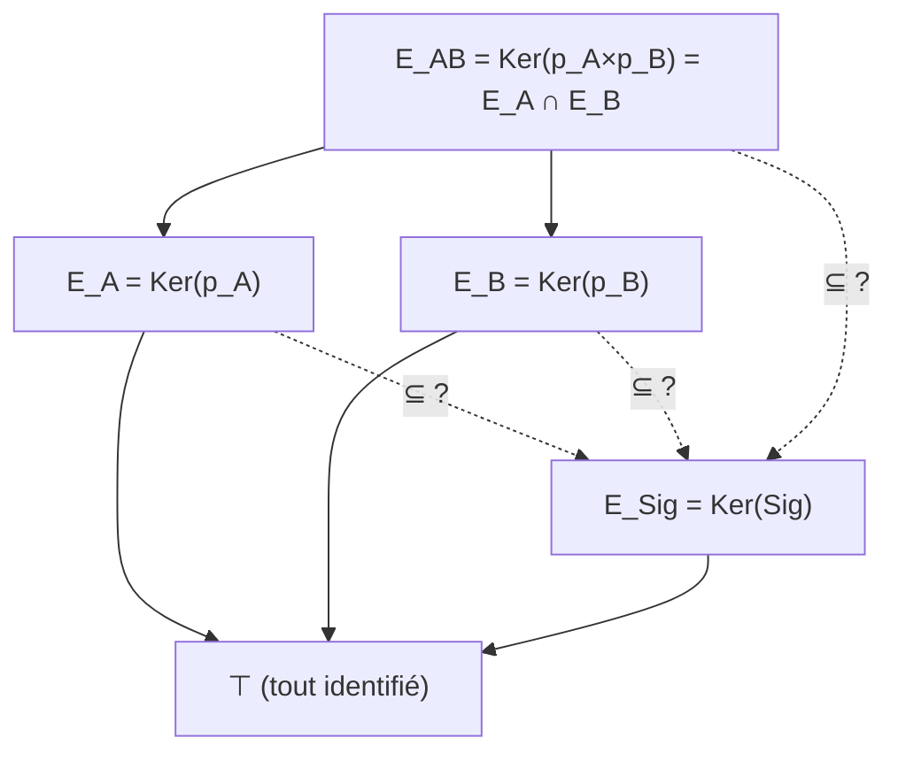

## Invariant relatif de clôture prédictive (fiche de lecture)

### Idée (en une phrase)

On compare **les distinctions accessibles aux interfaces** avec **les distinctions requises par la dynamique**,
en encodant cette comparaison comme une configuration de partitions sur le même espace d’états.

---

## 1) Données minimales

On fixe :

- un ensemble (ou type) d’états présents `X`,
- deux interfaces (observations marginales) :
  - `p_A : X → Y_A`
  - `p_B : X → Y_B`
- une **signature future** (profil dynamique) :
  - `Sig : X → S`

On associe les relations d’équivalence (partitions) induites :

- `E_A := Ker(p_A)`  (ce que l’interface A confond),
- `E_B := Ker(p_B)`  (ce que l’interface B confond),
- `E_Sig := Ker(Sig)` (ce que la dynamique autorise à confondre tout en gardant le même profil futur).

Le joint correspond à :

- `p_AB := (p_A, p_B) : X → Y_A × Y_B`
- `E_AB := Ker(p_AB) = E_A ∩ E_B`.

---

## 2) Les trois tests de clôture (lecture directe)

Une interface est **suffisante pour la signature** quand elle ne confond jamais deux états de signatures différentes.

- **Clôture depuis A** :
  - `E_A ⊆ E_Sig`
  - équivalent à : `p_A(x)=p_A(x') → Sig(x)=Sig(x')`
  - équivalent à la factorisation : `Sig = Sig_A ∘ p_A` (pour un unique `Sig_A : im(p_A) → S`).

- **Clôture depuis B** :
  - `E_B ⊆ E_Sig`
  - équivalent à : `Sig = Sig_B ∘ p_B`.

- **Clôture depuis le joint** :
  - `E_AB ⊆ E_Sig`
  - équivalent à : `Sig = Sig_AB ∘ (p_A, p_B)`.

**Irréductibilité marginale** : `E_A ⊄ E_Sig` (resp. `E_B ⊄ E_Sig`) signifie :
il existe deux états identiques pour A (resp. B) mais à signatures futures différentes.

---

## 3) L’objet invariant (ce qui est “mesuré”)

L’invariant relatif de clôture prédictive est la configuration :

- `I_AB := [X ; E_A, E_B, E_Sig]`

prise à isomorphisme près (bijections `X ≃ X'` transportant simultanément `E_A, E_B, E_Sig`), c’est-à-dire :
on identifie deux présentations qui ne diffèrent que par un renommage bijectif des états préservant exactement
les trois partitions (donc le diagnostic d’inclusion `⊆` entre elles).

Objet équivalent : le diagramme intrinsèque

- `X → X/E_A × X/E_B × X/E_Sig`.

Invariants dérivés utiles :

- **dimension dynamique** : `|X/E_Sig| = |im(Sig)|`,
- **suffisance marginale** : `E_A ⊆ E_Sig`, `E_B ⊆ E_Sig`,
- **suffisance jointe** : `E_A ∩ E_B ⊆ E_Sig`,
- **insuffisance structurée** : `E_A ⊄ E_Sig`, `E_B ⊄ E_Sig`.

---

## 4) Figure (treillis local des partitions pertinentes)

Lecture : “`E1 ⊆ E2`” signifie que `E1` est **plus fine** (elle confond moins) que `E2`.
Donc `E_A ⊆ E_Sig` exprime que l’interface A ne perd aucune distinction requise par la signature.

### Surcouche de diagnostic (où se place `E_Sig`)

Le schéma fixe les nœuds “structurels” (`E_A`, `E_B`, `E_AB`) et la référence dynamique (`E_Sig`).
Le diagnostic consiste ensuite à décider quelles inclusions pointillées sont vraies :

- **Clôture depuis A** : `E_A ⊆ E_Sig` (flèche pointillée `E_A → E_Sig` vraie).
- **Clôture depuis B** : `E_B ⊆ E_Sig`.
- **Clôture depuis le joint** : `E_AB ⊆ E_Sig`.
- **Irréductibilité marginale** : `E_A ⊄ E_Sig` et/ou `E_B ⊄ E_Sig` (au moins une flèche pointillée est fausse).

Le cas “canonique” de complémentarité observationnelle est :

- `E_A ⊄ E_Sig`, `E_B ⊄ E_Sig`, mais `E_A ∩ E_B = E_AB ⊆ E_Sig`.

---

## 5) Exemple fini (non trivial, très court) : XOR

On prend :

- `X = {00, 01, 10, 11}`,
- `p_A` = 1er bit, `p_B` = 2e bit,
- `Sig(x) := xor(x)` (jouet).

Partitions :

- fibres de `p_A` : `{00,01}` et `{10,11}`,
- fibres de `p_B` : `{00,10}` et `{01,11}`,
- classes de `Sig` : `{00,11}` et `{01,10}`.

Témoins :

- `00 ~_{E_A} 01` mais `Sig(00)≠Sig(01)` donc `E_A ⊄ E_Sig`,
- `00 ~_{E_B} 10` mais `Sig(00)≠Sig(10)` donc `E_B ⊄ E_Sig`,
- le joint `(p_A,p_B)` est injectif, donc `E_AB` est l’égalité, donc `E_AB ⊆ E_Sig`.

Conclusion :

- chaque marginale échoue,
- le joint rend la signature lisible :
  - `Sig(x) = xor(p_A(x), p_B(x))`.

---

## 6) Exemple “signature future” (dynamique minimale)

Même `X`, mêmes `p_A`, `p_B`. On introduit une dynamique `T : X → X` et une signature future à horizon 1 :

- dynamique jouet : `T(u,v) := (u, u xor v)`,
- signature future : `Sig(u,v) := p_B(T(u,v))`.

Alors :

- `Sig(u,v) = u xor v`,

donc on retombe exactement sur l’exemple XOR, mais interprété ainsi :

> `E_Sig` est la partition minimale exigée pour **prédire une observable future** (ici la prochaine valeur de B),
> et les tests `E_A ⊆ E_Sig`, `E_B ⊆ E_Sig`, `E_A ∩ E_B ⊆ E_Sig` diagnostiquent quelles interfaces
> ferment (ou non) cette prédiction.

---

## 7) Règle de lecture (encadré)

Une fois `E_Sig` fixé (signature future choisie), tout se lit par inclusion :

- `E_A ⊆ E_Sig` : A suffit pour la clôture prédictive.
- `E_B ⊆ E_Sig` : B suffit pour la clôture prédictive.
- `E_A ⊄ E_Sig` : insuffisance marginale structurée de A (distinctions écrasées).
- `E_A ∩ E_B ⊆ E_Sig` : la vue jointe suffit (clôture au joint).

Le cœur est donc un diagnostic d’**accessibilité de la clôture prédictive par interface**,
et l’invariant `I_AB` enregistre la position relative des partitions qui portent ce diagnostic.
