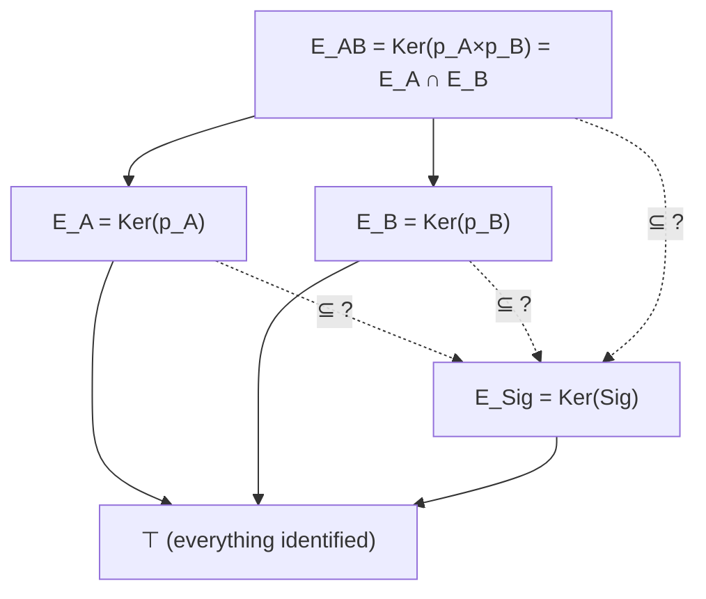

## Relative Predictive-Closure Invariant (reading sheet)

### Idea (one sentence)

Compare **the distinctions accessible from interfaces** with **the distinctions required by the dynamics**,
by encoding this comparison as a configuration of partitions on the same state space.

---

## 1) Minimal data

Fix:

- a set (or type) of present states `X`,
- two interfaces (marginal observations):
  - `p_A : X → Y_A`
  - `p_B : X → Y_B`
- a **future signature** (dynamic profile):
  - `Sig : X → S`

Associate the induced equivalence relations (partitions):

- `E_A := Ker(p_A)`  (what interface A identifies),
- `E_B := Ker(p_B)`  (what interface B identifies),
- `E_Sig := Ker(Sig)` (what the dynamics allows us to identify while preserving the same future profile).

The joint corresponds to:

- `p_AB := (p_A, p_B) : X → Y_A × Y_B`
- `E_AB := Ker(p_AB) = E_A ∩ E_B`.

---

## 2) The three closure tests (direct reading)

An interface is **sufficient for the signature** when it never identifies two states with different future signatures.

- **Closure from A**:
  - `E_A ⊆ E_Sig`
  - equivalent: `p_A(x)=p_A(x') → Sig(x)=Sig(x')`
  - equivalent factorization: `Sig = Sig_A ∘ p_A` (for a unique `Sig_A : im(p_A) → S`).

- **Closure from B**:
  - `E_B ⊆ E_Sig`
  - equivalent: `Sig = Sig_B ∘ p_B`.

- **Closure from the joint**:
  - `E_AB ⊆ E_Sig`
  - equivalent: `Sig = Sig_AB ∘ (p_A, p_B)`.

**Marginal irreducibility**: `E_A ⊄ E_Sig` (resp. `E_B ⊄ E_Sig`) means:
there exist two states identical for A (resp. B) but with different future signatures.

---

## 3) The invariant object (what is “measured”)

The relative predictive-closure invariant is the configuration:

- `I_AB := [X ; E_A, E_B, E_Sig]`

taken up to isomorphism (bijections `X ≃ X'` transporting `E_A, E_B, E_Sig` simultaneously), i.e.:
two presentations are identified when they differ only by a bijective renaming of states that preserves
the three partitions exactly (and therefore the inclusion diagnostics `⊆` between them).

Equivalent object: the intrinsic diagram

- `X → X/E_A × X/E_B × X/E_Sig`.

Useful derived invariants:

- **dynamic dimension**: `|X/E_Sig| = |im(Sig)|`,
- **marginal sufficiency**: `E_A ⊆ E_Sig`, `E_B ⊆ E_Sig`,
- **joint sufficiency**: `E_A ∩ E_B ⊆ E_Sig`,
- **structured insufficiency**: `E_A ⊄ E_Sig`, `E_B ⊄ E_Sig`.

---

## 4) Figure (local lattice of relevant partitions)

Reading rule: “`E1 ⊆ E2`” means `E1` is **finer** (it identifies less) than `E2`.
So `E_A ⊆ E_Sig` expresses that interface A loses no distinction required by the signature.

### Diagnostic overlay (where `E_Sig` sits)

The diagram fixes the “structural” nodes (`E_A`, `E_B`, `E_AB`) and the dynamic reference (`E_Sig`).
The diagnostic is to decide which dotted inclusions hold:

- **Closure from A**: `E_A ⊆ E_Sig` (the dotted arrow `E_A → E_Sig` holds).
- **Closure from B**: `E_B ⊆ E_Sig`.
- **Closure from the joint**: `E_AB ⊆ E_Sig`.
- **Marginal irreducibility**: `E_A ⊄ E_Sig` and/or `E_B ⊄ E_Sig` (at least one dotted arrow fails).

The “canonical” observation-complementarity regime is:

- `E_A ⊄ E_Sig`, `E_B ⊄ E_Sig`, but `E_A ∩ E_B = E_AB ⊆ E_Sig`.

---

## 5) Finite example (non-trivial, very short): XOR

Take:

- `X = {00, 01, 10, 11}`,
- `p_A` = first bit, `p_B` = second bit,
- `Sig(x) := xor(x)` (toy).

Partitions:

- fibers of `p_A`: `{00,01}` and `{10,11}`,
- fibers of `p_B`: `{00,10}` and `{01,11}`,
- classes of `Sig`: `{00,11}` and `{01,10}`.

Witnesses:

- `00 ~_{E_A} 01` but `Sig(00)≠Sig(01)` so `E_A ⊄ E_Sig`,
- `00 ~_{E_B} 10` but `Sig(00)≠Sig(10)` so `E_B ⊄ E_Sig`,
- the joint `(p_A,p_B)` is injective, so `E_AB` is equality, so `E_AB ⊆ E_Sig`.

Conclusion:

- each marginal fails,
- the joint makes the signature readable:
  - `Sig(x) = xor(p_A(x), p_B(x))`.

---

## 6) “Future signature” example (minimal dynamics)

Same `X`, same `p_A`, `p_B`. Introduce dynamics `T : X → X` and a horizon-1 future signature:

- toy dynamics: `T(u,v) := (u, u xor v)`,
- future signature: `Sig(u,v) := p_B(T(u,v))`.

Then:

- `Sig(u,v) = u xor v`,

so we recover the XOR example, interpreted as:

> `E_Sig` is the minimal partition required to **predict a future observable** (here the next value of B),
> and the tests `E_A ⊆ E_Sig`, `E_B ⊆ E_Sig`, `E_A ∩ E_B ⊆ E_Sig` diagnose which interfaces
> close (or fail to close) that prediction.

---

## 7) Reading rule (boxed)

Once `E_Sig` is fixed (chosen future signature), everything is read via inclusion:

- `E_A ⊆ E_Sig`: A suffices for predictive closure.
- `E_B ⊆ E_Sig`: B suffices for predictive closure.
- `E_A ⊄ E_Sig`: structured marginal insufficiency of A (collapsed distinctions).
- `E_A ∩ E_B ⊆ E_Sig`: the joint suffices (closure at the joint).

The core is therefore a diagnostic of **predictive-closure accessibility by interface**,
and the invariant `I_AB` records the relative position of the partitions carrying this diagnostic.
